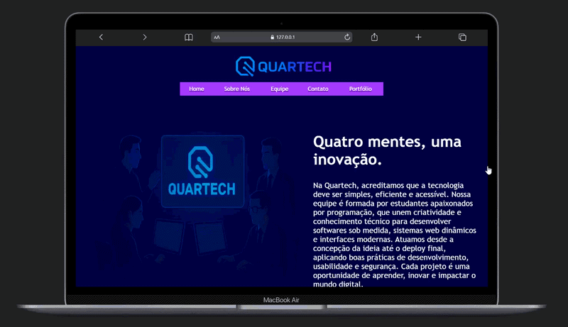

<div align="center">
  <h1>🚀 Site Institucional de Empresa Fictícia</h1>

  <p>
    Projeto desenvolvido como atividade acadêmica da disciplina de Front-end,
    com o objetivo de praticar a estruturação de páginas web utilizando HTML
    e a organização de conteúdo em um site institucional.
  </p>

  <br />

  

</div>

---

## 🌐 Demonstração

<div align="center">
  <p>Prévia visual da página inicial do projeto:</p>

  
</div>

---

<p align="center">
  <a href="https://eusam04.github.io/Quartech/" target="_blank">
    
  </a>
</p>

---

## ✨ Sobre o Projeto

Este projeto consiste no desenvolvimento de um site institucional para uma empresa fictícia, com o objetivo de simular um ambiente real de apresentação de serviços e informações.

Durante o desenvolvimento, foram trabalhados conceitos como:

- estruturação de páginas HTML
- organização de conteúdo
- criação de múltiplas páginas interligadas
- construção de navegação entre seções

O projeto faz parte do meu processo de aprendizado como estudante de tecnologia, contribuindo para o desenvolvimento de habilidades em front-end.

---

## 🛠️ Tecnologias Utilizadas

- HTML

---

## 📁 Estrutura do Projeto

```text
Quartech/
├── imagens/         # Imagens utilizadas no site
├── index.html       # Página inicial
├── sobre-nos.html   # Sobre nós
├── portfolio.html   # Portfólio
├── equipe.html      # Equipe
└── contato.html     # Formulário de contato
